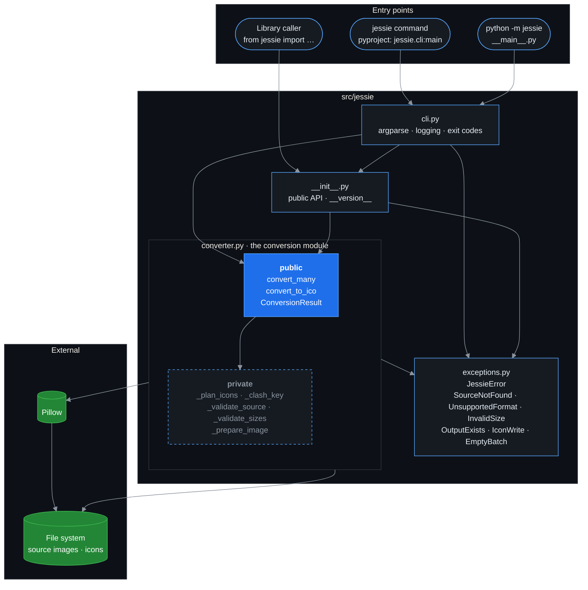
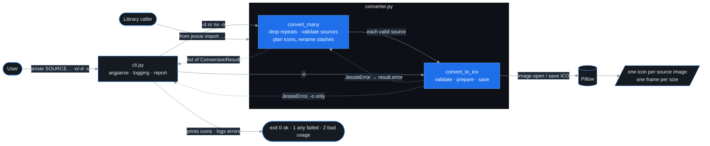

# Jessie

[Image to Favicon Converter]()

Convert **JPG, JPEG and PNG** images into multi-resolution Windows **.ico** files, powered by [Pillow](https://python-pillow.org/) and managed with [uv](https://docs.astral.sh/uv/).

## Quick start

```bash
uv sync                          # create .venv and install everything
uv run jessie logo.png           # -> logo.ico (16–256 px)
```

## Usage

```bash
uv run jessie photo.jpg -o app.ico            # explicit output
uv run jessie a.png b.jpeg -d icons/          # batch into a folder
uv run jessie logo.png -s 16,32,48 --force    # custom sizes, overwrite
uv run jessie wide.png --no-pad               # keep aspect ratio instead of transparent padding
python -m jessie logo.png                     # module form
```

As a library:

```python
from jessie import convert_many, convert_to_ico

convert_to_ico("logo.png", "build/app.ico", sizes=[16, 32, 256], overwrite=True)

# Batch: one result per source; clashing names (logo.png + logo.jpg) are renamed, never overwritten
for result in convert_many(["logo.png", "logo.jpg"], "build/icons"):
    print(result.icon if result.ok else result.error)
```

## Architecture

Modules in `src/jessie` and what each imports. Arrows point from importer to imported.



- `converter.py` never imports `cli.py`: it doesn't print or exit, and every failure it raises is a `JessieError`.
- The helpers prefixed `_` are private. Tests go through `convert_to_ico`, `convert_many` and `cli.main`.
- Pillow is the only runtime dependency.

## How a conversion flows



## Development

| Task | Command |
|---|---|
| Install | `make install` / `uv sync` |
| Format | `make format` |
| Lint | `make lint` |
| Type-check | `make typecheck` |
| Test + coverage | `make test` |
| Everything CI runs | `make check` |

See [`docs/`](docs/index.md) for architecture, usage, development, testing and contribution guides.
