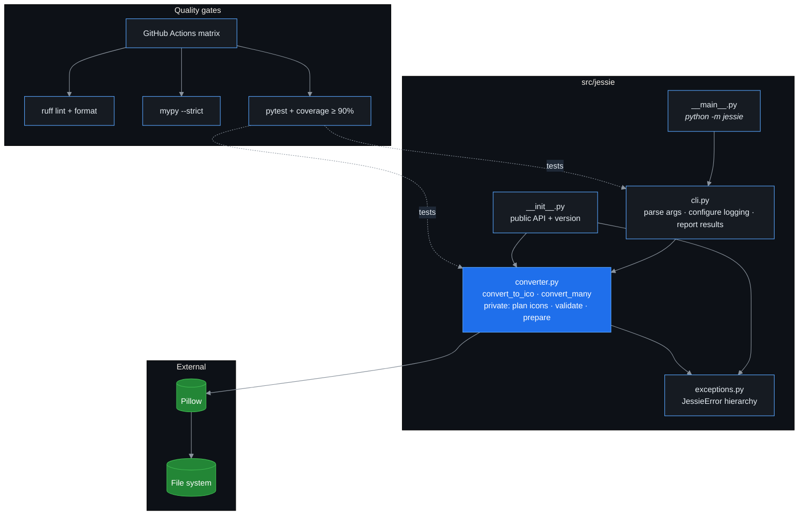
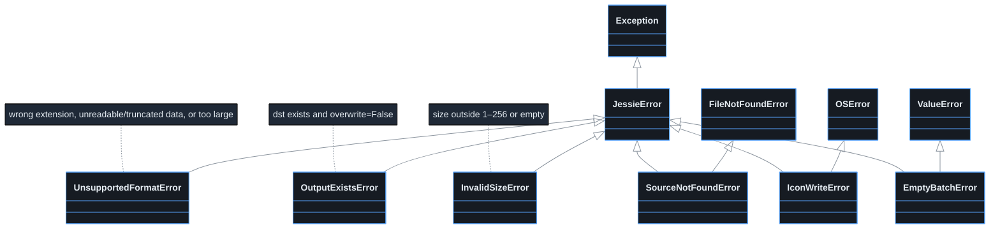

# Architecture

## Goals

- Turn a single JPG/JPEG/PNG into a Windows `.ico` containing several resolutions.
- Keep the conversion logic a **pure library** so it can be reused outside the CLI.
- Fail loudly with typed errors; never silently overwrite files.

## Module map



## Conversion pipeline

```mermaid
%%{init: {'theme':'base','themeVariables':{'background':'#0d1117','primaryColor':'#161b22','primaryTextColor':'#e6edf3','primaryBorderColor':'#58a6ff','lineColor':'#8b949e','secondaryColor':'#1f2937','tertiaryColor':'#0d1117','fontFamily':'Inter, Segoe UI, sans-serif','fontSize':'14px','noteBkgColor':'#1f2937','noteTextColor':'#e6edf3','actorBkg':'#161b22','actorBorder':'#58a6ff','actorTextColor':'#e6edf3','signalColor':'#8b949e','signalTextColor':'#e6edf3'}}}%%
sequenceDiagram
    autonumber
    actor User
    participant CLI as cli.main
    participant C as converter
    participant P as Pillow
    User->>CLI: jessie logo.png logo.jpg -d out
    CLI->>C: convert_many(sources, out, sizes, pad, overwrite)
    C->>C: validate sizes (1–256, dedupe, sort)
    C->>C: drop repeated sources · validate each (exists? .jpg/.jpeg/.png?); invalid ones fail now
    C->>C: plan icons for valid sources, renaming clashes (logo.png.ico, logo.jpg.ico)
    loop each valid source
    C->>C: convert_to_ico(src, icon)
    C->>C: resolve dst, check overwrite
    C->>P: Image.open(src)
    P-->>C: Image
    C->>C: prepare_image → RGBA, pad to square, upscale if < max size
    C->>P: save(dst, format="ICO", sizes=[...])
    P-->>C: file written
    end
    C-->>CLI: list[ConversionResult], one per entry (repeats flagged)
    CLI-->>User: prints each icon, logs each error (skipping repeats), exit 0 or 1
    Note over CLI,C: A failing source becomes an error result; the batch continues. With -o, the CLI calls convert_to_ico directly.
```

## Error model



## Key decisions

| Decision | Rationale |
|---|---|
| Pad to a transparent square by default | ICO frames are expected to be square. `--no-pad` opts out; frames then keep the source aspect ratio (Pillow thumbnails, it doesn't stretch). |
| Upscale small sources to the largest size | Pillow silently drops ICO frames larger than the source; upscaling guarantees every requested size is present (a warning is logged). |
| Always convert to RGBA | JPEGs have no alpha; ICO consumers expect it and padding needs transparency. |
| `src/` layout + hatchling | Prevents tests passing against an un-installed tree. |
| ruff for lint *and* format | One fast tool replaces flake8, isort, black, pydocstyle. |
| Library raises, CLI catches | Keeps `converter` reusable and testable without subprocesses. |
| Every failure is a `JessieError` | Callers catch one type. `SourceNotFoundError` and `IconWriteError` also subclass `FileNotFoundError` / `OSError` so older handlers keep working. |
| Batches live in the library (`convert_many`) | Only code that sees the whole batch can spot two sources claiming the same icon. |
| Clashing icons are all renamed after their source | `logo.png.ico` / `logo.jpg.ico` don't depend on argument order and show where each icon came from; a counter handles identical names. |
| Tests go through `convert_to_ico` / `convert_many` | Helpers are private; tests check the frames of the icon actually written. |
